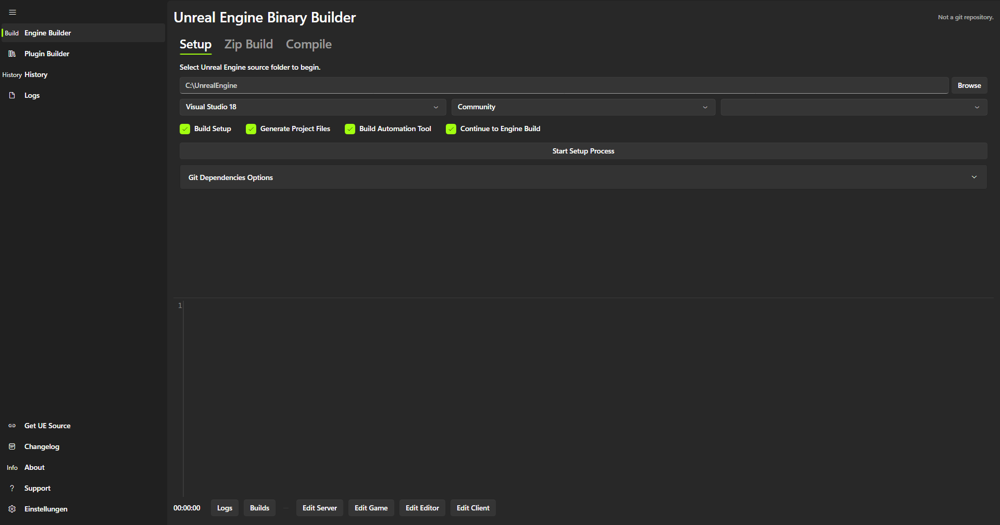
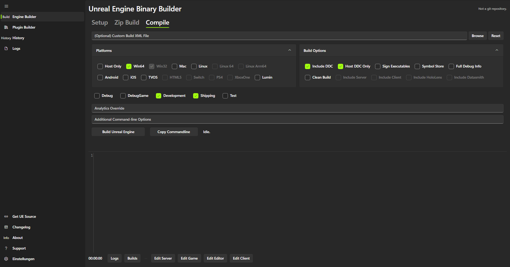
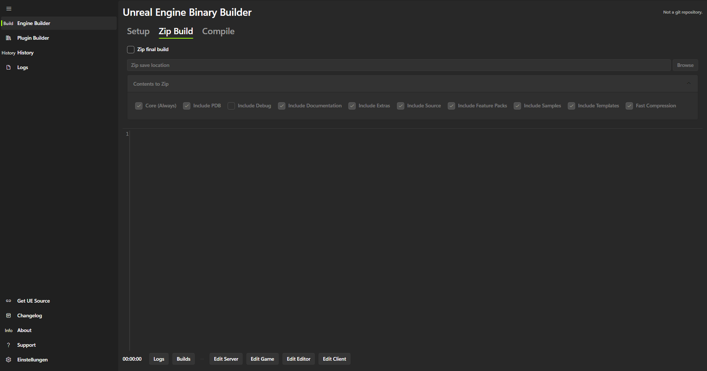
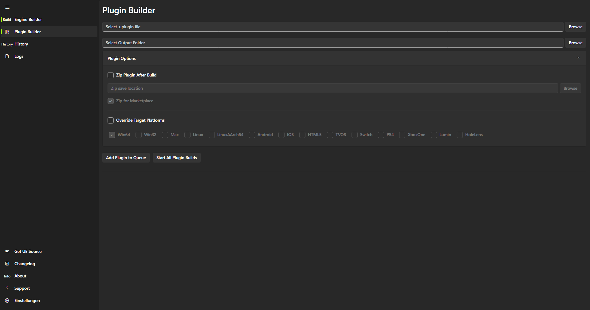

Unreal Engine Binary Builder
======================

<a href="https://www.buymeacoffee.com/ryanjon2040" target="_blank"></a>
*(Support the original author)*

This is a cross-platform desktop application designed to create binary builds (Installed Builds) of [Unreal Engine](https://www.unrealengine.com/) and plugins directly from [GitHub source](https://github.com/EpicGames/UnrealEngine).


 
  

### 🚀 v4.0 Avalonia Port Update
Unreal Binary Builder has been completely rewritten using **Avalonia UI** and **.NET 10.0**. This massive architectural upgrade brings the application natively to **Windows, Linux, and macOS** with a modern Fluent UI, improved asynchronous build orchestration (no more UI freezing during long compilations!), and integrated cross-platform updates.

### 🛠️ Developer Setup & Build
Unreal Binary Builder now supports **CMake** for build system generation, alongside standard `.sln` and `.csproj` workflows.

#### Build with CMake (Recommended for Visual Studio)
1.  Ensure you have **CMake 3.10+** and the **.NET 10.0 SDK** installed.
2.  Configure the build specifying a Visual Studio generator (required for C# support):
    ```bash
    cmake -G "Visual Studio 17 2022" -A x64 -B build
    ```
3.  Open the generated `UnrealBinaryBuilder.sln` in `build/` or build from CLI:
    ```bash
    cmake --build build --config Release
    ```

#### Build with dotnet CLI
```bash
dotnet build --configuration Release
```

# Features

* **Cross-Platform**: Run on Windows, Linux, or macOS.
* **Full Build Orchestration**: Chain `Setup.bat`, `GenerateProjectFiles`, and `AutomationTool` executions.
* **Plugin Builder**: Build and package Unreal Engine plugins for the Marketplace across multiple platforms.
* **Visual Studio Integration**: Dynamically detects your VS installation, edition, and architecture.
* **Integrated Code Editor**: Edit `.Target.cs` files directly within the app using AvaloniaEdit.
* **Build History**: Keep track of all your past builds, their durations, and configurations.
* **Smart Resume**: Intelligent orchestration allows you to resume a failed build from the last successful stage.
* **Advanced Options**: Configure DDC, signing, custom XML build scripts, Git dependency caching, and more.
* **Real-time Logging**: Monitor build progress, view compiled file counts, and export logs.

# Getting Started

### 📥 Installation
1.  Download the latest release from the [Releases](https://github.com/Olli1080/Unreal-Binary-Builder/releases) page.
    *   **Windows**: Download `UnrealBinaryBuilder-Windows-x64.zip`. Extract and run `UnrealBinaryBuilder.exe`.
    *   **Linux**: Download the `.AppImage` file, make it executable (`chmod +x`), and run it.
    *   **macOS**: Download the `.pkg` or zip for your architecture (Intel or Apple Silicon).
2.  Follow the steps below to build your engine or plugins.

### ✨ Automatic Updates
Unreal Binary Builder now features **native GitHub updates** via Velopack. When a new version is released on GitHub, the application will notify you and offer to download and install it automatically in the background.

# How to use (Compiling Engine)

###### Step I 
- Download the latest release of Unreal Binary Builder for your OS.

###### Step II
- Clone or Download UE4/UE5 source from GitHub.

###### Step III
- Open Unreal Binary Builder.
- Navigate to the **Engine Builder** tab -> **Setup** sub-tab.
- Click *Browse* and select the **root folder** of your downloaded Engine (where **_Setup.bat_** exists).
- Choose your Setup Options and Git Dependency settings, then click **Start Setup Process**.



###### Step IV
- Navigate to the **Compile** sub-tab.
- Select your target platforms, build options (like DDC, Clean Build), and Game Configurations.
- Click **Build Unreal Engine**.



# Features in Detail

### Engine Builder
Manage full Unreal Engine source builds, including setup, compilation, and optional packaging.

#### Zip Build
You can automatically zip your final engine build for easy distribution.


### Plugin Builder
Batch build and package plugins for multiple Unreal Engine versions and platforms.



# Automation & Documentation

### 📸 Automatic Screenshot Generation
This project includes a built-in tool to automatically generate documentation screenshots. If you are a developer running from source, you can refresh the screenshots in the `Documentation/` folder by running the application with the following argument:

```bash
dotnet run --project UnrealBinaryBuilder.Avalonia/UnrealBinaryBuilder.Avalonia.csproj -- --generate-screenshots
```

# Troubleshoot

**Access Denied on some files?**</br>
On Windows, just change the ownership to Users then try again. To change ownership on Windows, follow these steps
 - Right click on the Unreal Engine folder, choose Properties
 - Switch to Security tab
 - Click on Advanced
 - Near the top, click on Change User
 - A new dialog will open, in the text box at bottom, type in "Users", then click Check Names
 - OK till the end.

#### Dependencies & Acknowledgements

* [Avalonia UI](https://avaloniaui.net/) - The premier cross-platform UI framework for .NET.
* [FluentAvalonia](https://github.com/amwx/FluentAvalonia) by [amwx](https://github.com/amwx)
* [AvaloniaEdit](https://github.com/AvaloniaUI/AvaloniaEdit)
* [LibGit2Sharp](https://github.com/libgit2/libgit2sharp)
* [GameAnalytics](https://github.com/GameAnalytics/GA-SDK-C-SHARP) by [Game Analytics](https://gameanalytics.com/)
* [Newtonsoft.Json](https://www.newtonsoft.com/json)
* [Sentry.NET](https://github.com/getsentry/sentry-dotnet) by [Sentry](https://sentry.io/)
* [Velopack](https://velopack.io/) - Native GitHub-powered update management.
* CommunityToolkit.Mvvm
